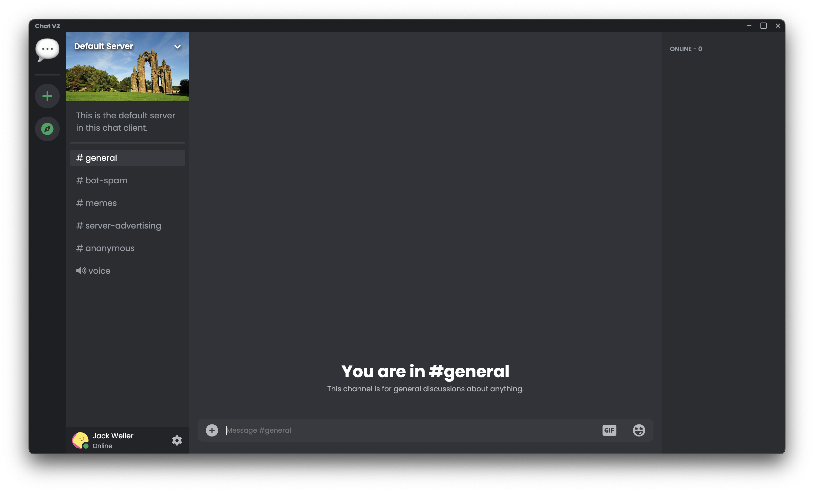

# Chat App
A simple discord clone made using nodejs and electron

> [!NOTE]  
> Most features that are in v1.9 are documented [here](https://jack-weller.gitbook.io/chat/)

## Example


## Setup

The chat client is easy to setup

1. Goto [firebase console](https://console.firebase.google.com/u/0/)
2. Create a firebase project (Disable analytics)
3. Build > Firestore Database > Click "Create Database" > Enter Region > Click "Test Mode"
4. Build > Authentication > Click "Get Started" > Click "Email/Password" > Enable first choice
5. Click icon next to "Project Overview" > Project Settings > Scroll down to "Your Apps" > Click web icon "</>" > Enter name > Click "Register App"
6. Copy the contents of "firebaseConfig"
7. Goto "example.env" and rename to ".env"
8. Enter the contents of "firebaseConfig" into the corresponding fields
9. In terminal type `npm i`
10. Then run `npm start`

## Running

To initialize the firestore db, run
```bash
npm run initialize-firebase
```
To start the app locally, run
```bash
npm start
```
To build the app, run
```bash
npm run build
```
To create a user, run
```bash
npm run create-user
```
To create a server, run
```bash
npm run create-server
```